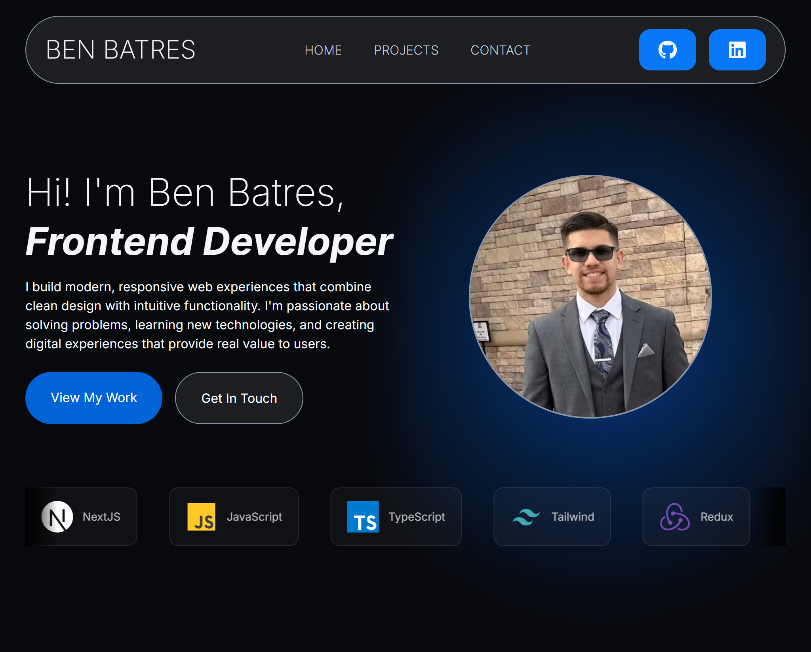

# Ben Batres — Portfolio Website

A clean, responsive, and modern portfolio application designed to showcase my work, skills, and technical projects as a Frontend Developer.

 

## 🚀 Live Demo

Check out the live website: [benjaminbatres.dev](https://me@benjaminbatres.dev)

## ✨ Features

- **Responsive Design:** Optimized for seamless viewing across mobile, tablet, and desktop screens.
- **Project Showcase:** Highlights real-world web applications with detailed tech stacks, descriptions, and links to live demos and source code.
- **Interactive UI:** Smooth transitions and modern layout design built using Framer Motion and Tailwind CSS.
- **Contact Integration:** Built-in contact form and direct links for recruiters and potential collaborators to get in touch.

## 🛠️ Tech Stack

- **Framework:** [Next.js](https://nextjs.org/)
- **Language:** [TypeScript](https://www.typescriptlang.org/) / [JavaScript](https://developer.mozilla.org/en-US/docs/Web/JavaScript)
- **Styling:** [Tailwind CSS](https://tailwindcss.com/)
- **State & Animations:** [Redux](https://redux.js.org/), [Framer Motion](https://www.framer.com/motion/)
- **Backend & Database:** [Firebase](https://firebase.google.com/)